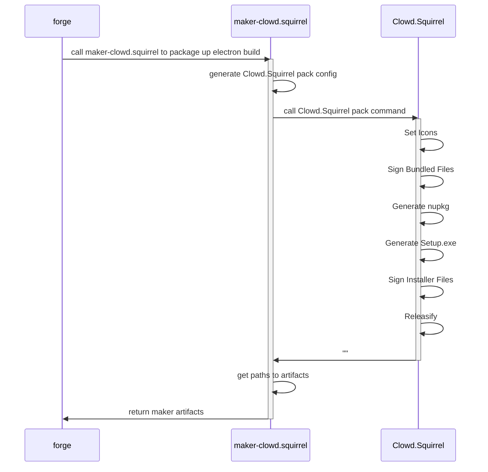

# Clowd.Squirrel Maker for Electron Forge

maker-clowd.squirrel is a electron forge maker package that uses [Clowd.Squirrel](https://github.com/clowd/Clowd.Squirrel) to package windows releases.

## Advantages of [Clowd.Squirrel](https://github.com/clowd/Clowd.Squirrel)?

See the [Clowd.Squirrel Feautre Matrix](https://github.com/clowd/Clowd.Squirrel#feature-matrix) for a detailed comparison to Squirrel.Windows.

- Use 3rd Party code signing tools.

  The signTemplate option can call 3rd party signing tools. This means one can use sign tools bundled with an HSM or Hardware Token. The signtool.exe (ver 6.1.7600.16385 from windows 7, pre SP1) bundled with maker-squirrel via winstaller was end-of-life 2011/2/22 and is 12 years out of date. The requirements for CSPs have changed and the bundled version of signtool isn't compatible with a lot of contemporary CSPs, especially unsigned CSPs. This old version of signtool doesn't properly handle pin policies, caching, or sessions, meaning you need to constantly reenter your pin when signing with a hardware key.

- Clowd.Squirrel does most of the work that electron-winstaller was doing.

  ClowdSquirrel handles generating nupkgs, setting icons, and fixing up paths that was done in winstaller. This helps shift responsibility for windows packaging from the EF maintainers to the Squirrel maintainers and eliminates one package (winstaller) that the Electron team needs to maintain.

- Clowd.Squirrel has an active and engaged lead developer.

  as of the time of this writing, @caesay is actively maintaining clowd.squirrel and keeping it current with the latest advances in windows and .NET. There is a pending 3.0 release that has quite a few architecture improvements along with Mac support. [Squirrel.Windows](https://github.com/Squirrel/Squirrel.Windows) on the other hand is actively looking for maintainers and hasn't had a release since 9/22/2020, over 2 years ago.

For a more detailed explanation of what drove the Clowd.Squirrel fork follow [@caesay's comments](https://github.com/Squirrel/Squirrel.Windows/issues/1470#issuecomment-901038089)

## What's different from maker-squirrel?

- Windows Only

  maker-squirrel used the [electron-winstaller](https://github.com/electron/windows-installer) package, which would use mono on linux or a mac to package your app. maker-clowd.squirrel does not support cross platform build and will need to be ran on a windows build agent. Clowd.Squirrel v3 is on the way and should provide cross platform support, but that work isn't expect to be complete until late 2023 / early 2024.

## Sequence Diagram

